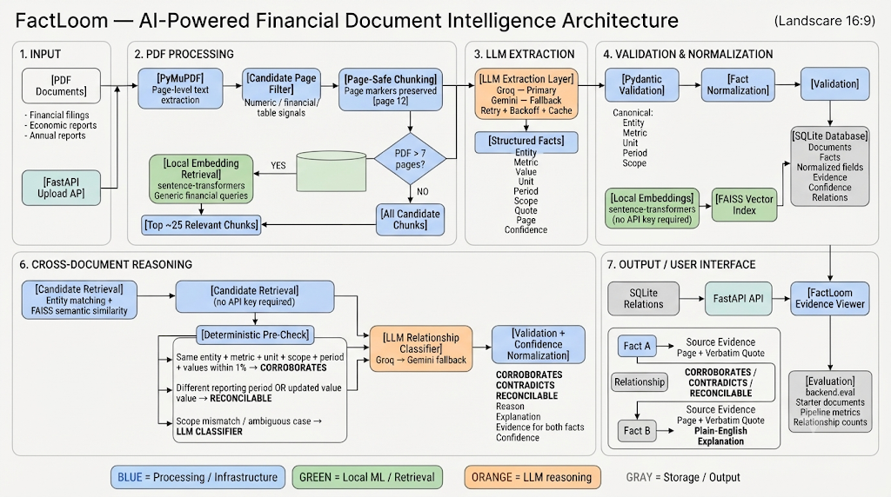

# SuperJoin Financial Intelligence

A fact knowledge layer for financial/economic PDFs: upload documents, extract grounded,
page-cited facts, and see how facts across documents corroborate, contradict, or reconcile
with each other — with a confidence score and a plain-English explanation for every call.

Built for the Superjoin VIT 2026 Engineering Intern assignment.

## Architecture



---

## Setup and Run Instructions

```bash
python -m venv venv
source venv/bin/activate        # Windows: venv\Scripts\activate
pip install -r requirements.txt

cp .env.example .env
# put GROQ_API_KEY and/or GEMINI_API_KEY in .env

uvicorn backend.main:app --reload
```

Open http://localhost:8000 — drag a PDF onto the upload box, browse extracted facts in
the middle column, and click any fact to see its source evidence and cross-document
relations in the right-hand panel.

Sample PDFs are in `data/starter-datasets/` (Delhivery filings + India macroeconomy
reports — several are 90–100 pages, useful for exercising the large-PDF path) and a few
smaller ones are already in `data/uploads/`.

Utility endpoints:
- `POST /upload` — upload and process one PDF
- `POST /reprocess` — reprocess every PDF already in `data/uploads/` (useful after a code change)
- `GET /documents`, `GET /facts`, `GET /facts/{id}/relations`, `GET /relations`, `GET /metrics`

`python -m backend.eval` runs all 6 starter documents through the full pipeline from the
command line and prints a summary grouped by relationship type — handy for manually
sanity-checking the four required cases without going through the UI.

**Sandbox note:** in the development container used to build this, outbound network
access to `api.groq.com` and `generativelanguage.googleapis.com` was blocked by the
container's egress allowlist, so live LLM calls could not be executed there. Everything
that doesn't require a live LLM call (parsing, chunking, the 7-page threshold, embeddings,
FAISS retrieval, deterministic relationship classification, confidence normalization,
validation, storage, and API error handling) was verified directly against real PDFs from
the starter datasets, including with a stubbed LLM layer standing in for the extraction
call. Run `python -m backend.eval` on a machine with normal network access to fully
exercise the live-LLM extraction and comparison paths end-to-end.

---

## Architecture / Approach

```
PDF
 → page-level text extraction (PyMuPDF)
 → candidate-page filter (numeric/financial/table signal — generic, no per-document rules)
 → chunking (page-safe, char-limited, page numbers preserved)
 → [PDFs > 7 pages only] embedding-based chunk retrieval (keep top ~25 most relevant chunks)
 → LLM extraction (Groq primary → Gemini fallback, retried, cached) → structured facts
 → validate (Pydantic)
 → normalize (canonical entity / metric / unit / period / scope)
 → validate
 → local embeddings (sentence-transformers, no API key) → FAISS index
 → validate
 → SQLite storage (facts + normalized fields + embedding + confidence)
 → cross-document candidate retrieval (entity match + FAISS semantic similarity)
 → deterministic relationship pre-check (fast path, no LLM call)
 → LLM relationship classification for anything ambiguous (Groq → Gemini)
 → validate + confidence normalization
 → stored relation (type, confidence, reason, explanation, evidence quotes for both facts)
```

### Fact extraction and evidence grounding

Each chunk sent to the LLM carries explicit page markers (`[page 12]`), and the extraction
prompt requires every fact to include a verbatim `quote` and the exact `page_no` it came
from. `validate.py` drops any fact that fails schema validation (missing quote, page
outside the chunk's actual range, etc.) rather than letting malformed data propagate — a
bad fact from one LLM call never corrupts the rest of the document's extraction. Every
fact stored in the UI is traceable back to `document → page → verbatim quote`.

### Cross-document corroboration, contradiction, and reconciliation

Two facts are only compared if a shared **entity** and **normalized metric** make them
candidates for comparison in the first place (`retrieve.py`). From there, `compare.py`
tries a **deterministic pre-check** before ever calling an LLM:

- Same entity, metric, unit, **and scope** (when both facts state one), values within 1%
  → `corroborates`.
- Same entity, metric, unit, and scope — but different **period** → `reconcilable`
  (`different_reporting_period`).
- Same entity, metric, unit, scope, and period — but values differ beyond 1% →
  `reconcilable` (`updated_information`, e.g. restated figures).
- If both facts state a **scope** and it differs (e.g. *consolidated* vs *standalone*),
  the deterministic path always defers to the LLM — a scope mismatch changes what "the
  same value" even means, and deciding whether that's a real conflict or a
  fully-explained difference needs semantic judgment, not a numeric rule. (Facts where
  neither side states a scope are not treated as conflicting on that basis.)
- Everything else — including every genuine `contradicts` verdict — goes to the LLM,
  which is given both facts' entity, metric, value, unit, **period, and scope**, plus
  their quotes, and must return a relation type, an explicit `reason` (one of
  `different_reporting_period`, `different_scope`, `different_definition`,
  `different_geography`, `different_unit`, `different_currency`, `updated_information`,
  `different_estimation_method`, or `none`), a short explanation, and a supporting quote
  from each fact.

This deterministic-first design exists so structurally-obvious cases (same everything,
same number; same everything but a different year) don't burn an LLM call, while anything
with real ambiguity — especially scope differences, which are easy to get wrong — is
handed to the model instead of guessed at with a numeric rule.

`unrelated` classifications are computed but not persisted, so the `relations` table only
ever contains meaningful cross-document links.

### Confidence scores

Both facts and relations carry a `0–1` confidence value, always present and always in
range:

- **Facts**: the extraction LLM assigns a qualitative `low` / `medium` / `high` label per
  fact (asking for a second, harder-to-calibrate numeric judgment per fact alongside
  entity/metric/value/etc. tends to be less reliable than a single qualitative call), which
  is mapped to a numeric `numeric_confidence` (`high→0.9`, `medium→0.6`, `low→0.35`) for
  display and sorting.
- **Relations**: the LLM (or the deterministic path) returns a `confidence` directly.
  Because LLM output for numeric fields is occasionally out of range (a percentage like
  `85` instead of `0.85`, a stray `1.2`, a non-numeric string), `models.py` **normalizes**
  rather than silently rejecting: percentages get rescaled, out-of-range or malformed
  values get clamped or defaulted, so a slightly-malformed model response never causes an
  otherwise-valid relation to be dropped.

These are **indicative, model-derived scores** — not statistically calibrated
probabilities — and are labeled that way in the code and should be read that way in the
UI (useful for sorting/triage, not as a precise likelihood).

### Large-PDF filtering and the 7-page threshold

- **≤ 7 pages**: unchanged normal pipeline. Every candidate chunk (pages with a numeric +
  financial/table signal) is sent to the LLM for extraction.
- **> 7 pages**: after the same candidate-page filtering, if the chunk count is large,
  chunks are embedded locally (the same `sentence-transformers` model already used for
  cross-document retrieval) and scored against a small set of **generic** retrieval
  queries ("revenue, profit, and earnings figures", "growth rates, margins, and ratios",
  "macroeconomic indicators such as GDP, inflation, and rates", etc. — describing the
  *kind* of content FactLoom extracts, not any specific company or document). Only the
  top-scoring ~25 chunks are sent to the LLM. `start_page` / `end_page` / `page_map` are
  untouched by this filter, so every fact extracted from a large PDF is still traceable to
  its exact source page.
- If local embeddings fail for any reason, the filter falls back to sending all chunks
  rather than silently dropping content — large-PDF handling degrades gracefully instead
  of failing the upload.
- This only changes **how much text reaches the LLM**, never **which** LLM provider
  handles it — the Groq-primary/Gemini-fallback chain is identical for small and large
  PDFs.

Verified directly (see Tests Performed) against the 89–100 page starter PDFs: a 100-page
annual report was filtered from 100 candidate chunks down to 25 relevant ones spanning 23
distinct pages, while a 3-page PDF went through the normal pipeline unfiltered.

### Evidence Viewer

Clicking a fact shows: entity/metric/value/unit, normalized value (when the value is
numeric), document, page, confidence badge, and the verbatim source quote. Its
cross-document relations are rendered as **Fact A → Evidence → Relationship → Fact B →
Evidence → Reasoning**: both facts' full evidence blocks (with their own confidence and
normalized value), the relationship badge with its confidence percentage and reason (e.g.
"different scope"), and the model's explanation, so the whole chain from raw quote to
final verdict is visible in one place without needing to cross-reference IDs.

### Important engineering decisions and trade-offs

- **Deterministic-first comparison**: cheaper and more consistent than always calling an
  LLM, but only for genuinely unambiguous structural matches — anything involving a real
  judgment call (contradictions, scope differences) is never decided by the numeric rule.
- **SQLite + a small number of tables, not a graph database**: a graph layer doesn't do
  the reasoning the assignment asks for; relations are computed and explained by the LLM
  or the deterministic rule, then stored as plain rows.
- **Free-text `scope`/`period`/`metric` fields, canonicalized via alias tables with a
  slugify fallback**: keeps the extractor from being hardcoded to the specific companies
  in the starter dataset — an unrecognized metric or entity still gets a reasonable
  canonical form instead of being dropped.
- **Confidence is indicative, not calibrated**: it's cheap to produce and useful for
  sorting/triage, but the README and UI are explicit that it is not a statistically
  rigorous probability.
- **Chunk-level, not fact-level, retrieval for large PDFs**: retrieving whole chunks
  (with page markers) rather than pre-extracting facts and retrieving those keeps the
  large-PDF path structurally identical to the small-PDF path from the LLM's point of
  view — it's still "extract facts from this chunk of text," just from a filtered set of
  chunks — instead of introducing a second, different extraction strategy.
- **Synchronous processing in the request handler**: `/upload` blocks until extraction and
  comparison finish. Fine for this assignment's scale (single user, a handful of PDFs at a
  time); a production version would move this to a background task/queue so a large PDF
  doesn't hold the HTTP connection open.

## Limitations and Next Steps

- **Real limitation encountered during this pass**: the deterministic comparison path
  originally did not check `scope` at all. Testing with synthetic same-value,
  same-period, different-scope facts (e.g. "consolidated" vs "standalone" revenue of the
  same amount) showed it was being auto-classified as `corroborates` — a false positive
  that the assignment specifically warns against ("different values are not automatically
  treated as contradictions when time, scope, units, etc. differ" — the same principle
  applies in reverse: same value with different scope is not automatically a
  corroboration either). This is now fixed: scope differences between two facts that both
  state one are always deferred to the LLM rather than decided by the numeric rule. This
  is documented here rather than papered over, per the assignment's request for an honest
  account of a real issue found during development.
- The relation `confidence` normalization (percentage rescaling, clamping) is a heuristic
  based on common LLM output slip-ups, not a guarantee — a genuinely unusual value could
  still be normalized incorrectly in an edge case.
- Metric/unit/entity alias tables in `normalize.py` are hand-curated and cover the kinds
  of terms likely in financial/macroeconomic PDFs; an unrecognized term still gets a
  reasonable fallback (slugified original) rather than being dropped, but won't
  necessarily match an equivalent term phrased very differently.
- No automated test suite (pytest) yet — this pass was validated via direct pipeline runs
  against the starter PDFs (with the LLM layer stubbed where live network access wasn't
  available) rather than a CI-style test suite. `tests/test_normalize.py`,
  `tests/test_compare.py`, `tests/test_parse.py` would be a reasonable next addition.
- The large-PDF chunk retrieval keeps the top ~25 chunks by similarity to generic
  financial-content queries; a document whose relevant facts are phrased very
  differently from those queries (e.g. an unusual metric type) could see a relevant chunk
  filtered out. Increasing `MAX_RETRIEVED_CHUNKS` or widening the query set in
  `parse.py` are the first levers to pull if that's observed in practice.
- `/upload` is synchronous — see trade-offs above.

## AI tools / providers used

- **Groq** (primary) and **Gemini** (fallback) for fact extraction and relationship
  classification, via `backend/providers/{groq,gemini}.py` behind a common
  retry/backoff/fallback layer (`backend/llm.py`).
- **sentence-transformers** (`BAAI/bge-small-en-v1.5` by default, local, no API key) for
  all embeddings — cross-document fact retrieval and large-PDF chunk retrieval both use
  the same local model.
- **FAISS** (`IndexFlatIP` over L2-normalized vectors) for fast nearest-neighbor search
  over fact embeddings.
- This implementation pass (architecture review, the 7-page/retrieval feature, confidence
  normalization, the scope-comparison fix, evidence-viewer UI, and this README) was done
  with Claude (Anthropic) as a coding assistant.

## Video Demo

*https://drive.google.com/drive/folders/1YniR495dxJJJXSGid-WYotVQT4Viyhp3?usp=sharing*

`https://drive.google.com/drive/folders/1YniR495dxJJJXSGid-WYotVQT4Viyhp3?usp=sharing`
